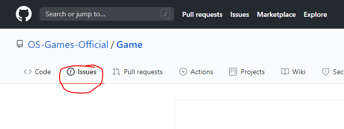
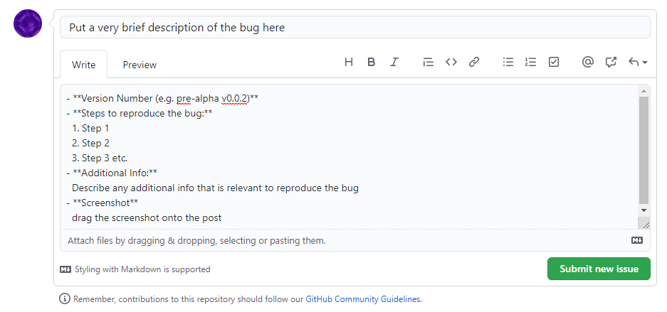

Bug Reports
=============
To produce a valid bug report, please include the following:

- Version number
- How to reproduce the bug
- A screenshot
- Additional Info (optional)

## How to report a bug
- Go to the 'Issues' tab

- Click the 'New Issue' button

- Describe the bug as documented <a href="#example-bug-report">below</a>

- Once you have documented the bug, press 'Submit new issue'

- The developer(s) will review the bug and it will be marked as resolved

## Example Bug report
### Bug Title
- **Version Number:** pre-alpha v0.0.x
- Steps to reproduce
  1. Do something
  2. Do something else
  3. The bug will do something
-**Additional Info**
  Additional information that is relevant to the bug.
- **Screenshot**
*Attach screenshot of bug*

<a href="README">Go Back</a>
